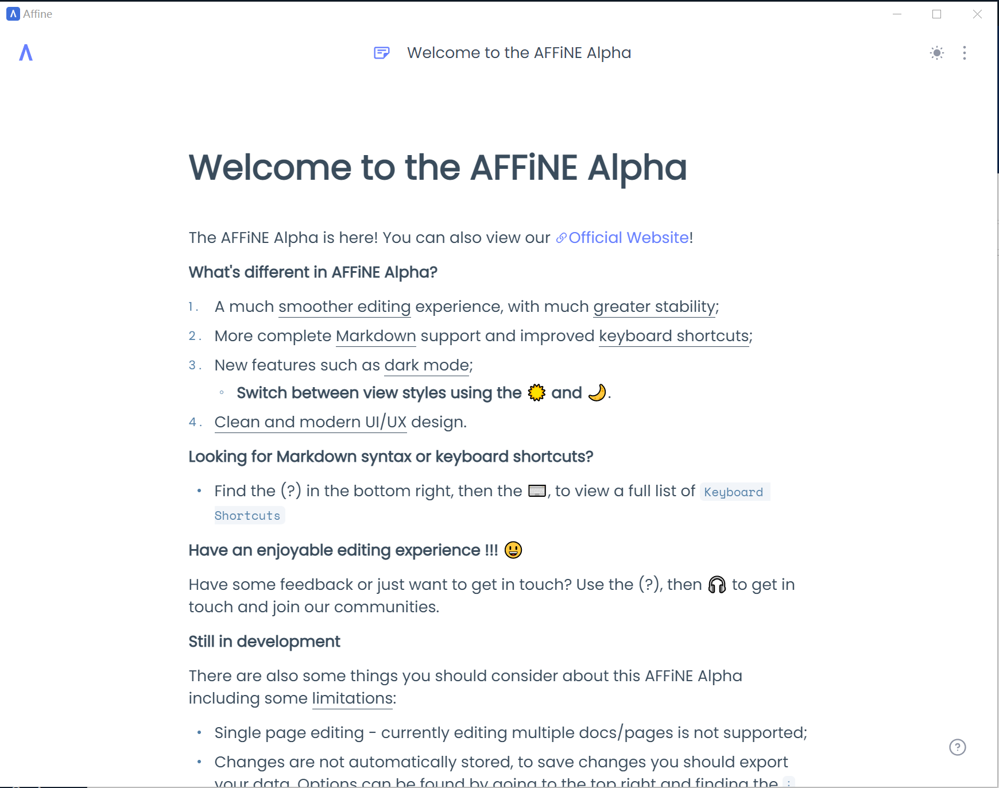

# Affine Client

affine-client is a client for [AFFINE](https://github.com/toeverything/AFFiNE) based on [Tauri](https://tauri.app/)

## Supported Platforms

- Windows
- Linux
- MacOS

## Download

`https://github.com/m1911star/affine-client/releases`

## Build

### System Requirements

- [Rust stable & Cargo](https://www.rust-lang.org/)
- [pnpm](https://pnpm.io/)

### How to build

1. install system requirements
2. git clone this repo (including submodule): git clone --recurse-submodules git@github.com:m1911star/affine-client.git
3. cd affine-client
4. `sh scripts/build.sh`

Navigate to `affine-client/tauri/target/release/bundle/` for target file

> It may fail when bundling, just retry

### Screenshot

## Limitations

This client is only a wrapper without any native api intergration for now.

## TODO

- [x] add build pipeline
- [x] speed up build

## Q&A

- if you come across an error `dlopen(): error loading libfuse.so.2 AppImages require FUSE to run.`, please install `fuse2` first
